# NIU Architecture Specification
## Network for Intelligent Urban Mobility

```
Smarter movement. Cleaner cities.
```

---

## 1. System Overview

NIU is architected as an event-driven, modular urban mobility management system. The platform bridges user-facing interfaces with computational mobility algorithms, operating on a unified telemetry and simulation layer. The design isolates presentation from data access and algorithmic calculation to enable zero-downtime transition from local simulated data providers to real-world hardware sensors, municipal traffic management systems (ITMS), and cloud persistence.

---

## 2. Multi-Tier Architectural Hierarchy

```mermaid
graph TD
    subgraph ClientPresentation ["1. Presentation Layer (Next.js App Router)"]
        UI_Dashboard["Mobility Command Center (/dashboard)"]
        UI_Traffic["Traffic Intelligence & Signals (/traffic)"]
        UI_Carpool["Carpool Network (/carpool)"]
        UI_Routes["Smart Route Comparison (/routes)"]
        UI_Impact["Sustainability Analytics (/impact)"]
        UI_Map["Custom Interactive SVG Canvas Map"]
    end

    subgraph UIComponents ["2. Reusable Component Subsystem"]
        C_Layout["Header, Sidebar & Mobile Nav"]
        C_Traffic["Signal Timing & Intersection Panels"]
        C_Carpool["Ride Search & Match Cards"]
        C_Routes["Route Comparison & Elevation Profiles"]
        C_Impact["Emissions Charts & NIU Scorecard"]
        C_Emerg["Emergency Corridor Controls"]
    end

    subgraph SimulationLayer ["3. State & Simulation Layer"]
        SimEngine["Simulation Engine (Tick & Event Hub)"]
        DataStore["Typed InMemory Data Providers"]
        RushHour["Temporal Rush-Hour Multiplier"]
        EmergState["Emergency Corridor Pre-emption State"]
    end

    subgraph MobilityEngines ["4. Core Algorithmic Mobility Engines"]
        Eng_Traffic["Traffic Engine (Density & Congestion Index)"]
        Eng_Signal["Signal Optimizer (Deterministic Webster-based)"]
        Eng_Carpool["Carpool Engine (Multi-parameter Matcher)"]
        Eng_Routing["Routing Engine (Provider Interface)"]
        Eng_Emissions["Emissions Engine (IPCC Fuel & CO2 Modeling)"]
        Eng_Emerg["Emergency Priority Engine (Green-Wave Routing)"]
    end

    subgraph FutureIntegrations ["5. Future Pluggable Integrations (Phase 9-10)"]
        Ext_Mapbox["Mapbox GL / Vector Tiles / OSRM"]
        Ext_Supabase["Supabase PostgreSQL & Realtime"]
        Ext_Sensors["Municipal ITMS / SCATS / Loop Detectors"]
        Ext_ML["Python/FastAPI Deep Learning Prediction Service"]
    end

    ClientPresentation --> UIComponents
    UIComponents --> SimulationLayer
    SimulationLayer --> MobilityEngines
    MobilityEngines -.-> FutureIntegrations
```



---

## 3. Core Engine Specifications

### 3.1. Traffic Engine (`src/lib/traffic/traffic-engine.ts`)
- **Responsibility**: Computes continuous urban flow dynamics, aggregate vehicle density, queue velocities, delay metrics, and intersection congestion indices ($CI \in [0, 100]$).
- **Formula**:
  $$CI = 0.40 \cdot \left(\frac{Q}{Q_{\max}}\right) + 0.35 \cdot \left(\frac{V}{V_{\max}}\right) + 0.25 \cdot \left(1 - \frac{S}{S_{\text{free}}}\right)$$
  Where $Q$ = queue length (meters), $V$ = vehicle count, $S$ = current speed, and $S_{\text{free}}$ = free-flow velocity (50 km/h).

### 3.2. Signal Optimization Engine (`src/lib/traffic/signal-optimizer.ts`)
- **Responsibility**: Calculates adaptive green time allocations for multi-phase signalized intersections.
- **Algorithm**: Deterministic volume-to-capacity split adhering to fixed cycle bounds ($C \in [90s, 140s]$) with a minimum safety green ($G_{\min} = 15s$) and yellow clearance ($Y = 4s$).
- **Output**: Directional splits (North, South, East, West), estimated delay reduction percentage (20–40%), and queue clearance projections.

### 3.3. Carpool Matching Engine (`src/lib/carpool/matching.ts`)
- **Responsibility**: Computes deterministic ride compatibility without black-box AI approximations.
- **Evaluation Weights**:
  - Spatial Overlap ($W_1 = 0.45$): Coordinate proximity between passenger trip corridor and driver waypoints.
  - Departure Time Affinity ($W_2 = 0.30$): Absolute time difference decay function:
    $$S_t = \max\left(0, 1 - \frac{|\Delta t|}{30\text{ min}}\right)$$
  - Route Detour Cost ($W_3 = 0.15$): Incremental distance penalty added to host itinerary.
  - Occupancy Optimization ($W_4 = 0.10$): Passenger capacity utilization.

### 3.4. Routing Engine (`src/lib/routing/routing-engine.ts`)
- **Responsibility**: Abstract routing service decoupling UI consumers from route providers through the `IRouteProvider` contract.
- **Profiles**:
  1. **FASTEST**: Minimizes transit duration, accepting higher stop-and-go arterial corridors.
  2. **BALANCED**: Optimizes fuel economy against travel time, avoiding severe bottlenecks.
  3. **GREENEST**: Minimizes carbon output by prioritizing continuous momentum roads, lower elevation variance, and steady speed regimes.

### 3.5. Emissions Engine (`src/lib/emissions/emissions-engine.ts`)
- **Responsibility**: Standardized IPCC/EPA carbon accounting.
- **Emission Factors**:
  - Petrol: $2.31\text{ kg CO}_2/\text{L}$
  - Diesel: $2.68\text{ kg CO}_2/\text{L}$
  - Hybrid: $1.45\text{ kg CO}_2/\text{L}$
  - Electric Vehicle (EV): $0.082\text{ kg CO}_2/\text{km}$ (grid average emissions factor)
- **Functions**: Calculates raw fuel burn, vehicle life-cycle CO2 footprint, solo vs. pooled passenger split, and network-wide metric tons mitigated.

### 3.6. Emergency Priority Engine (`src/lib/emergency/emergency-engine.ts`)
- **Responsibility**: Simulates rapid pre-emption and synchronized "green-wave" corridors for emergency responders (ambulances/fire engines).
- **Execution Mechanism**:
  1. Identifies approaching emergency vehicle trajectory and ahead intersections.
  2. Overrides normal signal cycle at target nodes, switching the active transit approach to constant green.
  3. Evacuates intersection queues prior to vehicle arrival.
  4. Calculates comparative telemetry: Normal ETA vs. NIU Priority ETA and minutes saved.

---

## 4. Layer Decoupling & Future Service Adapters

Every engine defines an abstract TypeScript contract allowing instant hot-swapping:

| Domain | Simulated Provider (Phase 1) | Future Real Provider (Phase 9–10) |
| :--- | :--- | :--- |
| **Mapping & Tiles** | Custom Vector SVG Canvas | Mapbox GL JS / MapLibre |
| **Routing & Directions** | Deterministic Greater Noida Graph | Mapbox Directions API / OSRM |
| **Live Traffic Feeds** | Simulated Poisson Density Generator | TomTom Traffic / Municipal SCATS |
| **Persistence & Auth** | Typed In-Memory Store / LocalStorage | Supabase PostgreSQL + Row Level Security |
| **Traffic Prediction** | Polynomial Trend Synthesizer | Python/FastAPI LSTM / GNN Model |
